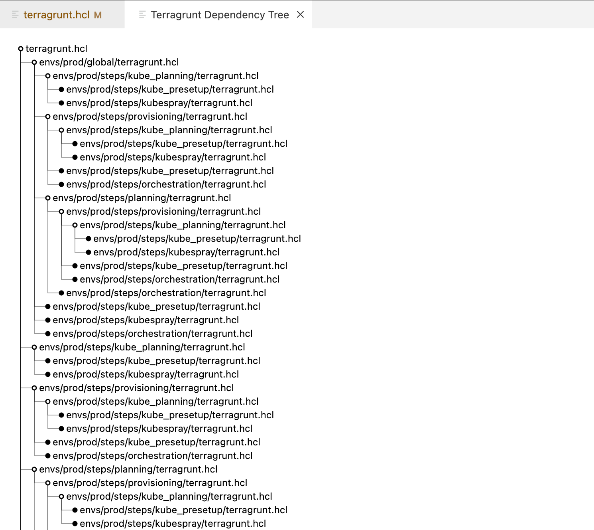

# Terragrunt HCL Language Server

Language Server Protocol (LSP) server for Terragrunt HCL files providing convenience features for Terragrunt configuration files in Visual Studio Code. Install it from vscode [marketplace](https://marketplace.visualstudio.com/items?itemName=BahramJoharshamshiri.hcl-lsp&ssr=false#review-details) or search "Terragrunt Language Server" in vscode extensions panel.

This extension is under active development and new features are being added regularly. Please report any issues or feature requests in the [GitHub repository](https://github.com/jowharshamshiri/tg-hcl-lsp/issues). 🚀🚀🚀

If you found this helpful, consider supporting my work with a [tip](https://ko-fi.com/jowharshamshiri). Your support helps me create more quality tools.

## Features

### Terragrunt.hcl Dependency Tree

Visualize the dependency tree of Terragrunt configuration files 🚀

Right-click in the editor and select "Show Terragrunt Dependency Tree" to view the dependency tree of the workspace.

### Syntax Highlighting and Validation

- Real-time error detection and diagnostics as you type
- Incremental document parsing for better performance
- Syntax highlighting for Terragrunt configuration files
- Document links for easy navigation

### IntelliSense

- Context-aware code completions
- Trigger completions automatically after typing '.', '=', or space
- Hover information for detailed documentation and type information with examples
- Locals and variables completions 🚀
- Output variables completions based on terraform state 🚀

### Document Management

- Full support for document lifecycle (open, change, close)
- Maintains parsed document state for quick access
- Workspace-aware language support

### Error Reporting

- Detailed diagnostic messages for syntax and semantic errors
- Real-time error updates as you edit

### Performance

- Incremental text document synchronization
- Efficient caching of parsed documents
- Optimized for large files and frequent updates

## Installation

1. Clone this repository:

   ```
   git clone https://github.com/jowharshamshiri/tg-hcl-lsp.git
   ```

2. Navigate to the project directory:

   ```
   cd tg-hcl-lsp
   ```

3. Install dependencies:

   ```
   npm install
   ```

4. Build the VS Code extension:

   ```
   npm run compile
   code .
   ```

## Contributing

Contributions are welcome! Please feel free to submit a Pull Request.

## License

This project is licensed under the MIT License - see the [LICENSE](LICENSE) file for details.

## Acknowledgments

- Thanks to the Terragrunt community for inspiration and use cases. Special thanks to rtizzy on github for reminding me to build this extension. Also thanks to and-win, gsouf, lucalooz, jonath92 for filing issues and feature requests.
