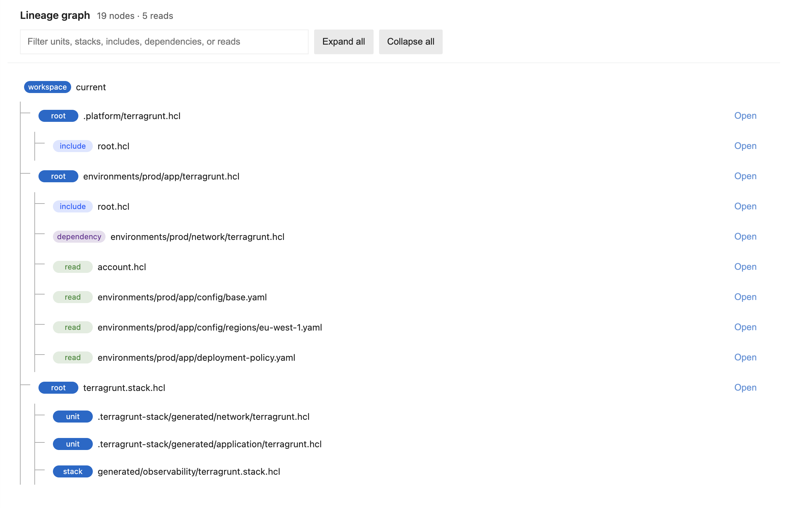

# Terragrunt HCL Language Server

VS Code language support for the current Terragrunt 1.x HCL language. Version 1 intentionally follows the current regime only; removed and deprecated compatibility syntax is reported instead of silently accepted.

Install “Terragrunt Language Server” from the [VS Code Marketplace](https://marketplace.visualstudio.com/items?itemName=BahramJoharshamshiri.hcl-lsp), or build the extension from this repository.



## Features

- Context-aware completion for blocks, attributes, functions, locals, dependencies, includes, features, values, units, and stacks
- File-kind-aware validation for unit, explicit stack, values, and autoinclude files
- Hover information and document links
- Workspace dependency graph covering includes, dependencies, units, and nested stacks
- Dependency output discovery from state
- Syntax highlighting for current Terragrunt blocks, attributes, references, and functions

The dependency graph follows VS Code interaction conventions. It opens with the first two levels visible, provides filter and expand/collapse controls, preserves the filter between views, uses full-row targets, and reports loading and empty states explicitly. “Open” is shown only for files inside the active workspace.

## Current Terragrunt syntax

Root configurations should use named includes and explicit filenames:

```hcl
include "root" {
  path = find_in_parent_folders("root.hcl")
}
```

Explicit stacks are recognized through `terragrunt.stack.hcl`:

```hcl
unit "network" {
  source = "../catalog/network"
  path   = "network"
}

unit "app" {
  source = "../catalog/app"
  path   = "app"

  autoinclude {
    dependency "network" {
      config_path = unit.network.path
    }
  }
}
```

The implementation tracks the official Terragrunt [blocks](https://docs.terragrunt.com/reference/hcl/blocks/), [attributes](https://docs.terragrunt.com/reference/hcl/attributes/), [functions](https://docs.terragrunt.com/reference/hcl/functions/), and [stacks](https://docs.terragrunt.com/features/stacks/) documentation.

## Development

Install dependencies and create the extension bundle:

```sh
npm install
npm run webpack
```

For continuous development, rebuild on source changes:

```sh
npm run watch
```

Launch the repository as a VS Code Extension Development Host after bundling it. Test completion, diagnostics, hover, and document links with current Terragrunt HCL files. Run **Show Terragrunt Lineage Graph** from the Command Palette while an HCL editor is active to inspect includes, dependencies, stacks, and reading lineage.

## License

MIT. See [LICENSE](LICENSE).

This is a community-supported project and is not affiliated with Gruntworks, Inc. or the Terragrunt project.